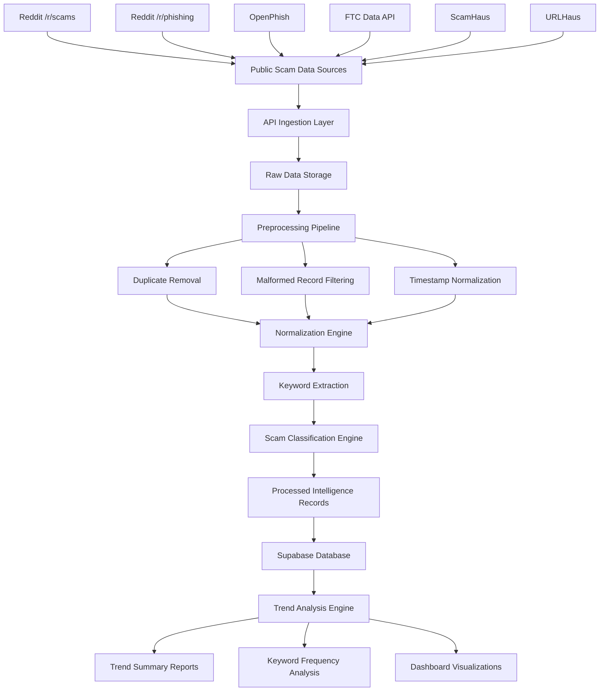

# ScamTrace Engine Architecture

```mermaid
flowchart TD
    A[Public Scam Data Sources] --> B[API Ingestion Layer]

    A1[Reddit /r/scams] --> A
    A2[Reddit /r/phishing] --> A
    A3[OpenPhish] --> A
    A4[FTC Data API] --> A
    A5[ScamHaus] --> A
    A6[URLHaus] --> A

    B --> C[Raw Data Storage]
    C --> D[Preprocessing Pipeline]

    D --> E[Duplicate Removal]
    D --> F[Malformed Record Filtering]
    D --> G[Timestamp Normalization]

    E --> H[Normalization Engine]
    F --> H
    G --> H

    H --> I[Keyword Extraction]
    I --> J[Scam Classification Engine]

    J --> K[Processed Intelligence Records]
    K --> L[Supabase Database]

    L --> M[Trend Analysis Engine]

    M --> N[Trend Summary Reports]
    M --> O[Keyword Frequency Analysis]
    M --> P[Dashboard Visualizations]
```