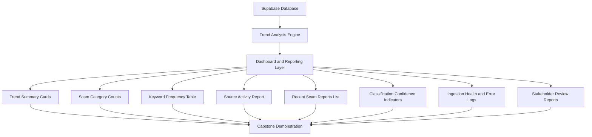

# ScamTrace Engine Dashboard and Reporting Outputs

```mermaid
flowchart TD
    A[Supabase Database] --> B[Trend Analysis Engine]
    B --> C[Dashboard and Reporting Layer]

    C --> D[Trend Summary Cards]
    C --> E[Scam Category Counts]
    C --> F[Keyword Frequency Table]
    C --> G[Source Activity Report]
    C --> H[Recent Scam Reports List]
    C --> I[Classification Confidence Indicators]
    C --> J[Ingestion Health and Error Logs]
    C --> K[Stakeholder Review Reports]

    D --> L[Capstone Demonstration]
    E --> L
    F --> L
    G --> L
    H --> L
    I --> L
    J --> L
    K --> L
```