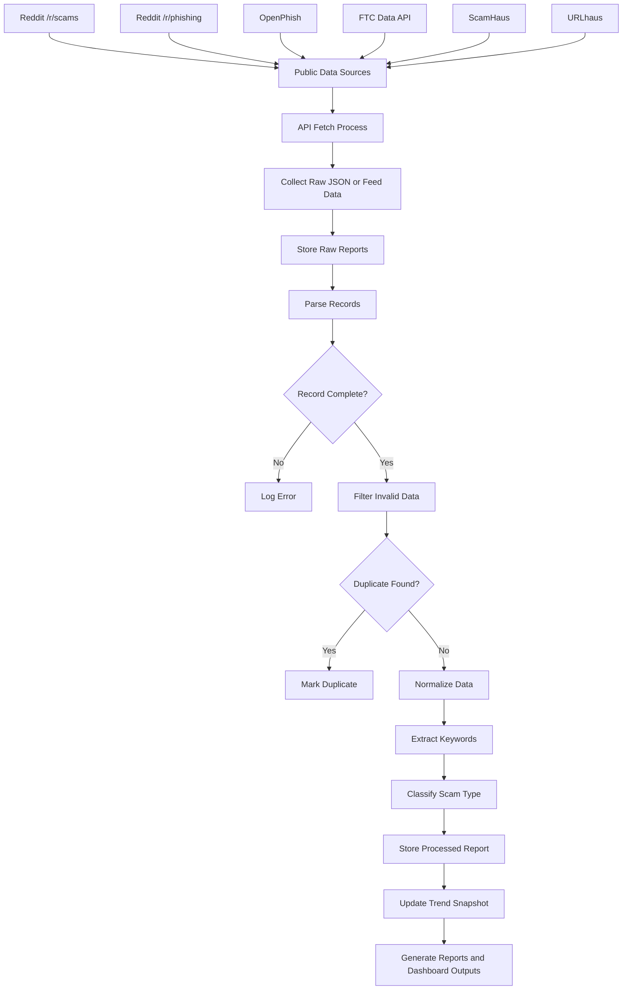

# ScamTrace Engine Data Flow Diagram

```mermaid
flowchart TD
    A[Public Data Sources] --> B[API Fetch Process]

    A1[Reddit /r/scams] --> A
    A2[Reddit /r/phishing] --> A
    A3[OpenPhish] --> A
    A4[FTC Data API] --> A
    A5[ScamHaus] --> A
    A6[URLhaus] --> A

    B --> C[Collect Raw JSON or Feed Data]
    C --> D[Store Raw Reports]
    D --> E[Parse Records]

    E --> F{Record Complete?}
    F -- No --> G[Log Error]
    F -- Yes --> H[Filter Invalid Data]

    H --> I{Duplicate Found?}
    I -- Yes --> J[Mark Duplicate]
    I -- No --> K[Normalize Data]

    K --> L[Extract Keywords]
    L --> M[Classify Scam Type]
    M --> N[Store Processed Report]
    N --> O[Update Trend Snapshot]
    O --> P[Generate Reports and Dashboard Outputs]
```