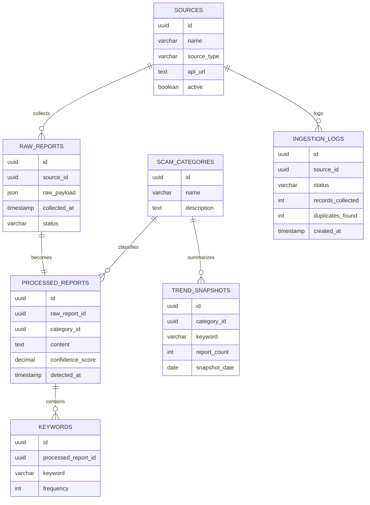

# ScamTrace Engine Database Schema

```mermaid
erDiagram

    SOURCES ||--o{ RAW_REPORTS : collects
    RAW_REPORTS ||--|| PROCESSED_REPORTS : becomes
    SCAM_CATEGORIES ||--o{ PROCESSED_REPORTS : classifies
    PROCESSED_REPORTS ||--o{ KEYWORDS : contains
    SCAM_CATEGORIES ||--o{ TREND_SNAPSHOTS : summarizes
    SOURCES ||--o{ INGESTION_LOGS : logs

    SOURCES {
        uuid id
        varchar name
        varchar source_type
        text api_url
        boolean active
    }

    RAW_REPORTS {
        uuid id
        uuid source_id
        json raw_payload
        timestamp collected_at
        varchar status
    }

    PROCESSED_REPORTS {
        uuid id
        uuid raw_report_id
        uuid category_id
        text content
        decimal confidence_score
        timestamp detected_at
    }

    SCAM_CATEGORIES {
        uuid id
        varchar name
        text description
    }

    KEYWORDS {
        uuid id
        uuid processed_report_id
        varchar keyword
        int frequency
    }

    TREND_SNAPSHOTS {
        uuid id
        uuid category_id
        varchar keyword
        int report_count
        date snapshot_date
    }

    INGESTION_LOGS {
        uuid id
        uuid source_id
        varchar status
        int records_collected
        int duplicates_found
        timestamp created_at
    }
```