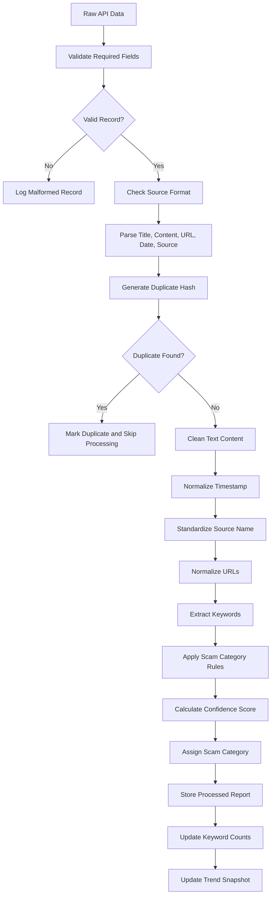

# ScamTrace Engine Processing Pipeline

```mermaid
flowchart TD
    A[Raw API Data] --> B[Validate Required Fields]

    B --> C{Valid Record?}
    C -- No --> D[Log Malformed Record]
    C -- Yes --> E[Check Source Format]

    E --> F[Parse Title, Content, URL, Date, Source]
    F --> G[Generate Duplicate Hash]

    G --> H{Duplicate Found?}
    H -- Yes --> I[Mark Duplicate and Skip Processing]
    H -- No --> J[Clean Text Content]

    J --> K[Normalize Timestamp]
    K --> L[Standardize Source Name]
    L --> M[Normalize URLs]
    M --> N[Extract Keywords]

    N --> O[Apply Scam Category Rules]
    O --> P[Calculate Confidence Score]
    P --> Q[Assign Scam Category]

    Q --> R[Store Processed Report]
    R --> S[Update Keyword Counts]
    S --> T[Update Trend Snapshot]
```